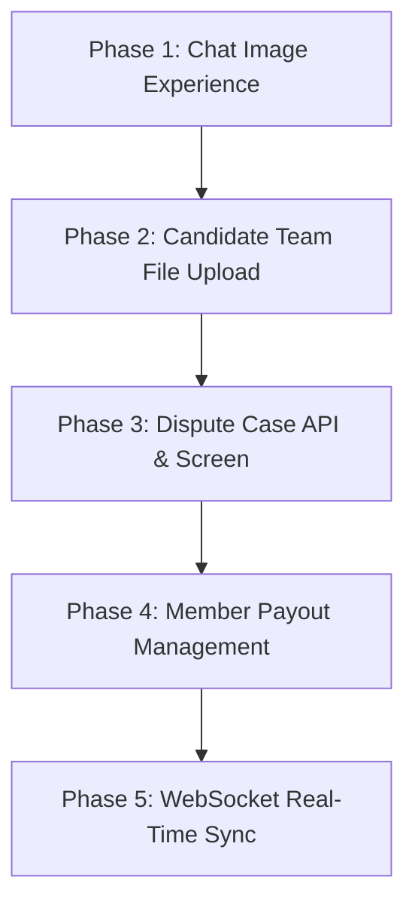

# Backend Implementation & Chat Media Architecture Plan

**Date**: 2026-09-17
**Status**: Proposal & Integration Plan
**Target Repositories**: `KUQuest-API-Server` & `KUQUest-Mobile`
**Authoritative References**: `CONTEXT.md`, `docs/rulebook/`, `docs/specs/`, `docs/agents/quest-api-v2-frontend-handoff.md`

---

## 1. Executive Summary & Status Assessment

### 1.1 Can Chat Send Pictures Yet?

#### Current Technical State

**Yes, mechanically at the transport level; No, from an end-user chat experience perspective.**

1. **What Works Today**:
   - **Image Selection**: `ChatConversationScreen.tsx` integrates `expo-image-picker`. Tapping the paperclip/attachment icon opens an action sheet allowing the user to select images from the Camera or Photo Library (`ImagePicker.launchCameraAsync` / `ImagePicker.launchImageLibraryAsync`).
   - **File Upload**: Images are uploaded via multipart form requests:
     - Work Chat: `POST /api/v1/chat/conversations/:conversationId/attachments`
     - Candidate Inquiry: `POST /api/v1/chat/candidate-inquiries/:conversationId/attachments`
   - **Message Sending**: The backend returns a typed `ServerChatAttachment` (`id`, `fileName`, `sizeBytes`, `mediaType`). When the user taps **Send**, the message payload passes `attachmentIds: [uploaded.id]`.
   - **Viewing**: Tapping an attachment card calls `openFile()`, queries `GET .../attachments/:id/link` for a 15-minute pre-signed URL, and opens the image via `Linking.openURL(link.url)` in the device's external browser (e.g. Chrome on Android).

2. **What Is Missing / Deficient (UX & Media Gaps)**:
   - **No Inline Image Thumbnails in Message Bubbles**: In `ChatConversationScreen.tsx` (lines 179–216, `AttachmentRow`), image attachments render solely as **generic file document cards** with an `ImagePlus` icon, file name (e.g. `chat-1726581234.jpg`), and file size (`1.2 MB`). The image itself is **never previewed or displayed inside the chat stream**.
   - **Kicked Out of the App to View Pictures**: Because there is no inline rendering or in-app lightbox, viewing an image redirects the user outside the mobile app to a web browser via `Linking.openURL`.
   - **No Composer Attachment Preview Bar**: When an image is picked, it uploads in the background and saves an attachment ID without showing any visual thumbnail or remove button (`[X]`) in the input composer before the user hits Send.
   - **15-Minute Link Expiry vs Inline Rendering**: The backend's signed attachment links expire after 15 minutes. To render inline images smoothly without breaking on scroll or expiring during an active chat session, mobile requires an attachment link resolution cache and pre-fetching mechanism.

---

### 1.2 Summary of Missing Backend Endpoints

While all 45 core Quest v2 endpoints are now implemented and wrapped on mobile, the following critical backend endpoints remain missing, blocked, or unspecified in the API contracts:

| Domain              | Missing / Incomplete Endpoint                                                     | Impact                                                                                                   | Required Resolution                                                                                              |
| :------------------ | :-------------------------------------------------------------------------------- | :------------------------------------------------------------------------------------------------------- | :--------------------------------------------------------------------------------------------------------------- |
| **Candidate Teams** | `POST /api/v2/quests/:questId/teams/:teamId/files`                                | Candidate teams cannot submit proposals with supporting files (proposals require private `fileIds`).     | Provide a private file upload route returning `fileId`, or accept multipart files directly on proposal submit.   |
| **Dispute Cases**   | `POST /api/v1/quests/:questId/disputes`                                           | Users cannot file a dispute within the 1-day window after `QUEST_FAILED` against the 7-day held escrow.  | Specify and implement dispute submission route, request schema, and evidence payload.                            |
| **Member Payouts**  | `GET / POST / DELETE /api/v1/payout-destinations`<br>`POST / GET /api/v1/payouts` | Workers cannot register Thai bank accounts/PromptPay or request payouts from their Earnings Balance.     | Implement student payout destination CRUD and payout initiation endpoints.                                       |
| **Chat Media**      | Enhanced `attachments` payload with image dimensions & thumbnail URL              | Chat images cannot render with proper aspect ratio placeholders; requires repeated link fetching.        | Include image dimensions (`width`, `height`) and direct image stream/thumbnail metadata in attachment responses. |
| **Real-time Sync**  | `WS /api/v1/chat/conversations/:id/events`                                        | Mobile must poll via calm refresh instead of receiving immediate message, proof, and quest state pushes. | Implement WebSocket event broadcasting for chat messages and quest lifecycle transitions.                        |

---

## 2. Part 1: Chat Picture & Media Overhaul (Mobile & Backend)

### 2.1 Backend Requirements for Chat Media

#### 1. Attachment Metadata & MIME Type Validation

- **Endpoint**: `POST /api/v1/chat/conversations/:conversationId/attachments` and `POST /api/v1/chat/candidate-inquiries/:conversationId/attachments`
- **Allowed MIME Types**: `image/jpeg`, `image/png`, `image/webp`, `image/heic`, `application/pdf`, `video/mp4`, `video/quicktime`.
- **Max File Size**: 10 MB (10,485,760 bytes).
- **Metadata Generation**: For image uploads, the backend should detect image dimensions (`width`, `height`) and return them in the attachment response:

```json
{
  "success": true,
  "data": {
    "attachment": {
      "id": "att_01HXYZ...",
      "fileName": "site_photo.jpg",
      "mediaType": "image/jpeg",
      "sizeBytes": 2048576,
      "width": 1920,
      "height": 1080,
      "createdAt": "2026-09-17T14:30:00+07:00"
    }
  }
}
```

#### 2. Pre-signed Media Link Caching & Streaming

- **Endpoint**: `GET /api/v1/chat/conversations/:conversationId/attachments/:attachmentId/link`
- **Response**:

```json
{
  "success": true,
  "data": {
    "attachmentId": "att_01HXYZ...",
    "url": "https://storage.kubits.org/attachments/...signed...",
    "expiresAt": "2026-09-17T14:45:00+07:00"
  }
}
```

- **CDN / Cache Headers**: The storage bucket / pre-signed URL MUST include appropriate `Cache-Control` headers (e.g. `private, max-age=900`) and CORS headers allowing image fetches from native mobile origins and `Image` components.

---

### 2.2 Mobile Requirements for Chat Media

#### 1. Inline Image Rendering in Message Bubbles (`MessageBubble.tsx`)

- Replace the purely text-based `AttachmentRow` for images with an **Inline Image Bubble**:
  - Detect `attachment.kind === "image"` or MIME type starting with `image/`.
  - Automatically fetch or resolve the pre-signed URL via an `AttachmentLinkCache`.
  - Render an optimized `<Image>` component:
    - Max bubble width: 260dp.
    - Max height: 320dp (maintaining aspect ratio).
    - Rounded corners: 14dp.
    - Shimmer/skeleton placeholder while loading.
    - Error fallback with a retry button if the link fails.
  - Non-image files (PDFs, ZIPs) continue to render with the clean document row style (`AttachmentRow`).

#### 2. In-App Fullscreen Lightbox Modal

- Tapping an inline image must **not** call `Linking.openURL` to open Chrome.
- Instead, open an in-app `ImageViewerModal`:
  - Black semi-transparent backdrop.
  - Pinch-to-zoom and pan gestures.
  - Top bar with file name, timestamp, and a **Close (X)** button.
  - Action button to save image to device gallery (using `expo-media-library`) or share.

#### 3. Composer Attachment Preview Bar

- In `ChatConversationScreen.tsx`, introduce a `PendingAttachmentsBar` above the input text field:
  - Display a horizontal scroll of picked image thumbnails (64x64dp rounded).
  - Show a small progress indicator on each thumbnail while uploading to the backend.
  - Include an `[X]` remove button on each chip to remove the attachment before sending.
  - Disable the **Send** button until all in-flight attachment uploads complete.

#### 4. Signed Link Cache (`attachmentLinkCache.ts`)

- Implement a lightweight in-memory cache for attachment links:
  - Map `attachmentId -> { url: string, expiresAt: number }`.
  - If cached and `now < expiresAt - 60_000` (1-minute safety margin), reuse the cached URL immediately.
  - Prevents hundreds of redundant `/link` HTTP requests when scrolling through chat history.

---

## 3. Part 2: Missing Backend Endpoints Specification

### 3.1 Endpoint 1: Candidate Team Private File Upload

#### The Problem

`POST /api/v2/quests/:questId/teams/:teamId/submit` requires:

```json
{
  "text": "Our team has experience in campus logistics...",
  "fileIds": ["file_01H..."]
}
```

However, no generic backend route exists to upload private files and receive a `fileId`.

#### Backend Specification

- **Method**: `POST`
- **Path**: `/api/v2/quests/:questId/teams/:teamId/files`
- **Authentication**: Member session (must be the Team Leader).
- **Headers**:
  - `Content-Type: multipart/form-data`
  - `Idempotency-Key: <unique-key>`
- **Multipart Field**: `file` (single file per call, up to 10 MB, PDF/image/doc).
- **Response**:

```json
{
  "success": true,
  "data": {
    "fileId": "team_file_01HXYZ789ABC",
    "fileName": "portfolio_deck.pdf",
    "sizeBytes": 4194304,
    "createdAt": "2026-09-17T15:00:00+07:00"
  }
}
```

- **Error Codes**:
  - `NOT_TEAM_LEADER`: Caller is not the creator/leader of the team.
  - `TEAM_ALREADY_SUBMITTED`: Cannot add files to an immutable submitted proposal.
  - `FILE_TOO_LARGE`: Exceeds 10 MB.
  - `INVALID_FILE_TYPE`: Unsupported extension/MIME.

---

### 3.2 Endpoint 2: Member Dispute Case Filing

#### The Problem

`docs/rulebook/admin/admin-dispute-case-contract.md` establishes a 1-day self-file window for Hirers and Workers after `QUEST_FAILED` against the 7-day held Funding Reservation. The client-facing filing endpoint is not documented in the v2 handoff.

#### Backend Specification

- **Method**: `POST`
- **Path**: `/api/v1/quests/:questId/disputes`
- **Authentication**: Member session (must be the Quest's Hirer or an assigned Worker).
- **Headers**:
  - `Content-Type: application/json`
  - `Idempotency-Key: <unique-key>`
- **Request Body**:

```json
{
  "reason": "PROOF_REJECTED_UNFAIRLY",
  "statement": "The completed cleaning met all specified condition items. Photos attached demonstrate full compliance.",
  "evidenceFileIds": ["proof_file_01...", "proof_file_02..."]
}
```

- **Validation Rules**:
  - Quest state MUST be `QUEST_FAILED`.
  - Current time MUST be within **24 hours** (`86,400,000 ms`) of `quest.failedAt`.
  - Caller MUST NOT have an existing open or resolved dispute case on this Quest (at most 1 per filer).
- **Response**:

```json
{
  "success": true,
  "data": {
    "dispute": {
      "id": "disp_01HXYZ...",
      "questId": "quest-123",
      "filerId": "student-456",
      "filerRole": "WORKER",
      "status": "DISPUTE_PENDING_ADMIN_REVIEW",
      "reason": "PROOF_REJECTED_UNFAIRLY",
      "statement": "The completed cleaning met all specified condition items...",
      "heldSatang": 10000,
      "filingDeadline": "2026-09-18T10:00:00+07:00",
      "holdExpiresAt": "2026-09-24T10:00:00+07:00",
      "createdAt": "2026-09-17T15:30:00+07:00"
    }
  }
}
```

- **Error Codes**:
  - `QUEST_NOT_FAILED`: Quest is in draft, open, assigned, in progress, or completed.
  - `DISPUTE_WINDOW_EXPIRED`: More than 24 hours have elapsed since failure.
  - `DISPUTE_ALREADY_FILED`: Caller already filed a dispute for this quest.
  - `NOT_QUEST_PARTICIPANT`: Caller was neither hirer nor assigned worker.

---

### 3.3 Endpoint 3: Member Payout Destinations & Withdrawal Requests

#### The Problem

Workers can earn funds in `earningsBalanceSatang` and convert to `spendingBalanceSatang`, but cannot register Thai bank accounts or withdraw money to PromptPay/bank accounts.

#### Backend Specification

##### 1. List Payout Destinations

- **Path**: `GET /api/v1/payout-destinations`
- **Response**:

```json
{
  "success": true,
  "data": {
    "destinations": [
      {
        "id": "dest_01...",
        "type": "PROMPTPAY",
        "accountHolderName": "Somchai Jaidee",
        "maskedAccount": "xxx-xxx-4567",
        "isDefault": true,
        "createdAt": "2026-09-10T10:00:00+07:00"
      }
    ]
  }
}
```

##### 2. Create Payout Destination

- **Path**: `POST /api/v1/payout-destinations`
- **Request Body**:

```json
{
  "type": "PROMPTPAY",
  "accountNumber": "0812344567",
  "accountHolderName": "Somchai Jaidee",
  "bankCode": null
}
```

_(Backend encrypts raw `accountNumber` using AES-256-GCM before DB insertion per ADR 0008; returns only masked display)._

##### 3. Request Payout (Initiate Withdrawal)

- **Path**: `POST /api/v1/payouts`
- **Headers**: `Idempotency-Key: <unique-key>`
- **Request Body**:

```json
{
  "amountSatang": 50000,
  "destinationId": "dest_01..."
}
```

- **Behavior**:
  - Validates `amountSatang >= minimumPayoutSatang` (e.g. ฿100.00 / 10,000 satang).
  - Validates `earningsBalanceSatang >= amountSatang`.
  - Atomically deducts `amountSatang` from `EARNINGS` and credits `RESERVED_FOR_PAYOUTS`.
  - Enqueues record with status `PENDING_ADMIN_APPROVAL` for admin review under `/api/v1/admin/payouts`.
- **Response**:

```json
{
  "success": true,
  "data": {
    "payout": {
      "id": "pay_01...",
      "amountSatang": 50000,
      "feeSatang": 0,
      "status": "PENDING_ADMIN_APPROVAL",
      "destination": {
        "type": "PROMPTPAY",
        "maskedAccount": "xxx-xxx-4567"
      },
      "createdAt": "2026-09-17T16:00:00+07:00"
    }
  }
}
```

##### 4. List Payout History

- **Path**: `GET /api/v1/payouts`
- **Response**: List of user payout requests with current state and status timeline.

---

### 3.4 Endpoint 4: WebSocket Real-Time Chat & State Sync

#### The Problem

Mobile currently uses focus-refresh and calm-polling. Real-time chat messages and status updates require WebSocket connections as defined in `docs/rulebook/quest/conversation-contract.md`.

#### Backend Specification

- **Paths**:
  - Work Chat: `WS /api/v1/chat/conversations/:conversationId/events`
  - Candidate Inquiry: `WS /api/v1/chat/candidate-inquiries/:conversationId/events`
- **Auth**: Sent via initial cookie session or `Sec-WebSocket-Protocol: Bearer <session-token>`.
- **Event Formats**:

```json
{
  "type": "chat.message.created",
  "data": {
    "conversationId": "conv-123",
    "message": {
      "id": "msg_01...",
      "sequence": 42,
      "kind": "USER",
      "sender": { "id": "student-1", "displayName": "Somchai" },
      "text": "I've arrived at the venue.",
      "attachments": [],
      "createdAt": "2026-09-17T16:05:00+07:00"
    }
  }
}
```

```json
{
  "type": "chat.read.updated",
  "data": {
    "conversationId": "conv-123",
    "userId": "student-1",
    "lastReadMessageId": "msg_01...",
    "readAt": "2026-09-17T16:05:30+07:00"
  }
}
```

```json
{
  "type": "quest.state.changed",
  "data": {
    "questId": "quest-123",
    "previousState": "QUEST_ASSIGNED",
    "newState": "QUEST_IN_PROGRESS",
    "timestamp": "2026-09-17T16:10:00+07:00"
  }
}
```

---

## 4. Implementation Phasing & Work Breakdown



### Phase 1: Mobile Chat Image Experience (Can Start Immediately)

- **Goal**: Transform chat image attachments from generic file download links to modern inline previews with an in-app viewer.
- **Mobile Tasks**:
  1. Add `AttachmentLinkCache` in `src/features/chat/attachmentCache.ts`.
  2. Update `ChatConversationScreen.tsx` to render `<Image>` thumbnails inside `MessageBubble` when `attachment.kind === "image"`.
  3. Create `ImageViewerModal` for pinch-to-zoom in-app photo viewing.
  4. Create `ComposerAttachmentBar` above text input showing pending uploads with remove `[X]` buttons.
- **Backend Tasks**:
  1. Verify S3/MinIO bucket storage on staging allows direct image streaming with proper CORS and cache headers.
  2. Return image dimensions (`width`, `height`) in attachment upload response.

### Phase 2: Candidate Team File Upload Integration

- **Goal**: Enable teams to upload supporting files for candidate proposals.
- **Backend Tasks**:
  1. Implement `POST /api/v2/quests/:questId/teams/:teamId/files` with multipart upload.
  2. Store file metadata in database table `quest_candidate_team_files`.
- **Mobile Tasks**:
  1. Add `uploadCandidateTeamFile` in `QuestApi.ts` & `liveQuestService.ts`.
  2. Wire document/image picker into `TeamAssembleSheet.tsx`.
  3. Pass returned `fileIds` to `liveQuestService.submitCandidateTeam`.

### Phase 3: Dispute Case API & Mobile Dispute Screen

- **Goal**: Enable workers and hirers to challenge unfair `QUEST_FAILED` outcomes.
- **Backend Tasks**:
  1. Implement `POST /api/v1/quests/:questId/disputes` with 24-hour window validation.
  2. Implement `GET /api/v1/quests/:questId/disputes` to check existing case status.
  3. Wire into existing Admin Dispute Case queue.
- **Mobile Tasks**:
  1. Create `DisputeApi.ts` and Zod schemas in `src/api/`.
  2. Add Dispute Case CTA button on `QuestWorkScreen` when `snapshot.state === "QUEST_FAILED"`.
  3. Create `src/app/quest/[id]/dispute.tsx` form screen with statement and proof selector.

### Phase 4: Member Payout Management

- **Goal**: Allow students to withdraw their quest earnings to Thai banks or PromptPay.
- **Backend Tasks**:
  1. Implement `/api/v1/payout-destinations` (AES-256-GCM storage, masked returns).
  2. Implement `POST /api/v1/payouts` (satang ledger transfer, pending admin approval).
- **Mobile Tasks**:
  1. Extend `WalletApi.ts` with destination and payout methods.
  2. Add **Withdraw Funds** button in `HomeWalletOverview.tsx`.
  3. Build `PayoutModal.tsx` for bank/PromptPay selection and withdrawal confirmation.

### Phase 5: WebSocket Real-Time Sync

- **Goal**: Replace polling with instant updates for messages and quest state.
- **Backend Tasks**:
  1. Mount WebSocket handlers on `/api/v1/chat/.../events`.
  2. Broadcast Redis/internal pub-sub events to connected room sockets.
- **Mobile Tasks**:
  1. Create `useChatSocket` hook in `src/features/chat/useChatSocket.ts`.
  2. Append incoming messages seamlessly without full screen reload.

---

## 5. Verification Matrix & Test Scenarios

### Chat Media Verification

- [ ] **Image Pick & Upload**: Pick JPEG from gallery &rarr; uploads to staging bucket &rarr; returns `ServerChatAttachment` with positive `sizeBytes`.
- [ ] **Inline Thumbnail Display**: Sent image displays with rounded corners, loading placeholder, and proper aspect ratio inside the message bubble.
- [ ] **In-App Lightbox**: Tapping image opens fullscreen zoomable modal within the app; device back button or `[X]` returns to chat without browser redirect.
- [ ] **Composer Preview Bar**: Selecting image shows thumbnail chip above input with spinner during upload; tapping `[X]` cancels/removes it before send.
- [ ] **15-Min Signed URL Cache**: Scrolling past 20 messages with pictures reuses cached URLs without triggering repeated `/link` network calls.
- [ ] **Candidate Inquiry Image**: Prospective worker and hirer can exchange photos in Candidate Inquiry pre-assignment with the same inline experience.

### Backend Endpoints Verification

- [ ] **Team Proposal File**: Team Leader uploads PDF to `POST /api/v2/quests/:id/teams/:id/files` &rarr; receives `fileId` &rarr; submits team with `fileIds: [fileId]` &rarr; Hirer can download file in candidate review.
- [ ] **Dispute 24h Window**: Worker submits dispute on `QUEST_FAILED` within 24h &rarr; 200 OK &rarr; 2nd dispute by same worker rejected with `DISPUTE_ALREADY_FILED` &rarr; dispute after 24h rejected with `DISPUTE_WINDOW_EXPIRED`.
- [ ] **Payout Satang Ledger**: Student with ฿500.00 earnings requests ฿200.00 payout &rarr; `earningsBalanceSatang` becomes 30,000; `reservedForPayoutsSatang` becomes 20,000; admin sees request in queue.
