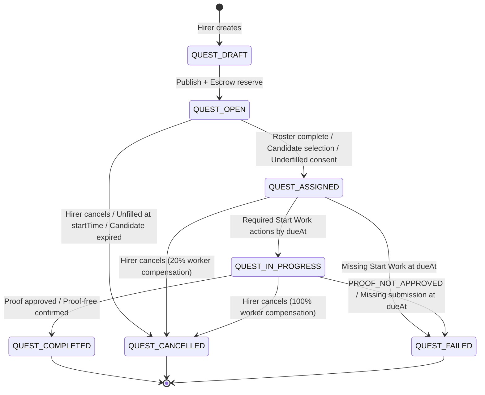

# Quest State and Lifecycle Specification

Type: Specification Reference
Domain: Quest Lifecycle, Assignments, UI Visibility
Authority: Aligned with the mirrored backend Quest Rulebook (`docs/rulebook/quest/`, synced from `KUQuest-API-Server` at commit `fc47a089f5ae4d40914ac771baef9f2e7a0bef63`). Defines the canonical states, transitions, and UI visibility rules for KUQuest Mobile.

---

## 1. Canonical State Model

A Quest has exactly one Quest Lifecycle State at any point in time.

| State               | Meaning                                                                 | Quest Board Discovery | Can Join / Apply | Work Chat Status                     | Required Actions                                                            |
| ------------------- | ----------------------------------------------------------------------- | --------------------- | ---------------- | ------------------------------------ | --------------------------------------------------------------------------- |
| `QUEST_DRAFT`       | Hirer is preparing and funding the Quest.                               | No                    | No               | None                                 | Hirer publishes with Quest Escrow funding.                                  |
| `QUEST_OPEN`        | Published and discoverable; accepting joins or Candidate applications.  | Yes                   | Yes              | Candidate Inquiry (1-on-1) available | Workers join (FCFS) or Candidates apply.                                    |
| `QUEST_ASSIGNED`    | Roster is fixed; Work Chat opens; awaiting Start Work.                  | No                    | No               | Active (Hirer + Active Workers)      | Hirer may edit condition (10m); required starter presses Start Work.        |
| `QUEST_IN_PROGRESS` | Work is underway between `startTime` and `dueAt`.                       | No                    | No               | Active (Hirer + Active Workers)      | Worker(s) / Team Leader perform work and submit proof / confirm completion. |
| `QUEST_COMPLETED`   | Work approved; rewards and fees settled; terminal.                      | No                    | No               | Read-Only Archive                    | Participants may submit Rating Reviews (7-day window).                      |
| `QUEST_CANCELLED`   | Quest cancelled before completion; funds refunded per policy; terminal. | No                    | No               | Read-Only Archive (if opened)        | Participants may submit Rating Reviews (7-day window).                      |
| `QUEST_FAILED`      | Overdue deadline, missing start, or unapproved proof; terminal.         | No                    | No               | Read-Only Archive                    | 7-day money hold; Dispute Case filing permitted; Rating Reviews available.  |

---

## 2. State Machine

---

## 3. Detailed State Transitions

| From                | Trigger / Guard                                                                                           | To                  | Assignment & Money Result                                                                                                                                         |
| ------------------- | --------------------------------------------------------------------------------------------------------- | ------------------- | ----------------------------------------------------------------------------------------------------------------------------------------------------------------- |
| `—`                 | Hirer creates Quest.                                                                                      | `QUEST_DRAFT`       | Draft saved; no Escrow reserved.                                                                                                                                  |
| `QUEST_DRAFT`       | Hirer publishes with valid conditions, `dueAt > startTime > now`, and sufficient Spending Balance.        | `QUEST_OPEN`        | Reserves Quest Escrow (`questFundingTotal × headcount`) from Spending Balance.                                                                                    |
| `QUEST_OPEN`        | FCFS roster reaches headcount, or Hirer selects Candidate/Team, or underfilled FCFS consent succeeds.     | `QUEST_ASSIGNED`    | Selected Workers become `ASSIGNMENT_ACTIVE`; Work Conversation opens; Candidate Inquiries soft-close (`INQUIRY_CLOSED`).                                          |
| `QUEST_OPEN`        | Hirer cancels, or open Candidate Quest reaches `startTime` unassigned, or underfilled FCFS consent fails. | `QUEST_CANCELLED`   | 100% of Quest Escrow refunded to Hirer Spending Balance.                                                                                                          |
| `QUEST_ASSIGNED`    | Required starter(s) press Start Work between `startTime` and `dueAt`.                                     | `QUEST_IN_PROGRESS` | `startedAt` set on active Assignments.                                                                                                                            |
| `QUEST_ASSIGNED`    | Hirer cancels while assigned.                                                                             | `QUEST_CANCELLED`   | 20% of Worker Reward pool paid to Active Workers (for `GROUP + CANDIDATE`, paid 100% to Team Leader); 80% and Platform Fee refunded to Hirer.                     |
| `QUEST_ASSIGNED`    | Required starter fails to press Start Work before `dueAt`.                                                | `QUEST_FAILED`      | Affected Assignments become `ASSIGNMENT_INCOMPLETE`; unpaid funds held for 7 days.                                                                                |
| `QUEST_IN_PROGRESS` | Required proof approved by Hirer or 24h auto-approval; or proof-free completion confirmed.                | `QUEST_COMPLETED`   | Worker Rewards transferred to Worker Earnings Balances (for `GROUP + CANDIDATE`, complete Worker Reward pool paid to Team Leader only); Platform Fee retained.    |
| `QUEST_IN_PROGRESS` | Hirer cancels while in progress.                                                                          | `QUEST_CANCELLED`   | 100% Worker Rewards paid to Active Workers (for `GROUP + CANDIDATE`, complete Worker Reward pool paid to Team Leader); Platform Fee retained; 0% refund to Hirer. |
| `QUEST_IN_PROGRESS` | Hirer decides `PROOF_NOT_APPROVED`, or required submission missing at `dueAt`.                            | `QUEST_FAILED`      | Affected Assignments become `ASSIGNMENT_INCOMPLETE`; Admin Review Item created; unpaid funds held for 7 days.                                                     |

---

## 4. Sub-State Protocols & Invariants

### 4.1 Start Work Protocol

- **Starter Rules**:
  - `SINGLE` (FCFS or Candidate): Worker presses Start Work.
  - `GROUP + FIRST_COME_FIRST_SERVED`: Every Active Worker must press Start Work.
  - `GROUP + CANDIDATE`: Team Leader presses Start Work on behalf of the team.
- **Window**: Between `startTime` and `dueAt`.
- **Failure**: Missing required start at `dueAt` transitions the Quest directly to `QUEST_FAILED`.

### 4.2 Underfilled GROUP + FCFS Consent Gate

- At `startTime`, if joined Active Workers < published headcount:
  1. Hirer has **10 minutes** to decide to proceed or cancel.
  2. If Hirer chooses proceed, all joined Workers have **10 minutes** to consent to the new split reward and `dueAt`.
  3. Unanimous consent moves Quest to `QUEST_ASSIGNED`.
  4. Any decline, timeout, or Hirer cancellation immediately transitions to `QUEST_CANCELLED` with a full refund.

### 4.3 Quest Edit Protocol

- Hirer can submit Quest Condition edits **only while in `QUEST_ASSIGNED`**.
- Does not change Quest State. Creates a Quest Edit record (`EDIT_REQUEST_PENDING`).
- All Active Workers have **10 minutes** to review and accept/decline.
- Unanimous accept &rarr; `EDIT_REQUEST_APPLIED` (Condition updated).
- Any decline or timeout &rarr; `EDIT_REQUEST_FAILED` (Condition unchanged).

### 4.4 Proof Review & Auto-Approval

- `PROOF_PENDING` has a **24-hour review window** from submission.
- Hirer approves &rarr; `PROOF_APPROVED` &rarr; `QUEST_COMPLETED`.
- 24 hours elapse with no decision &rarr; Server auto-approves (`PROOF_APPROVED`) &rarr; `QUEST_COMPLETED`.
- Hirer rejects &rarr; `PROOF_NOT_APPROVED` (requires reason &le;1,000 chars) &rarr; `QUEST_FAILED` immediately.
- **No Rework**: Rejection is final.

### 4.5 Post-Terminal Rules

- Terminal states (`QUEST_COMPLETED`, `QUEST_CANCELLED`, `QUEST_FAILED`) are permanent and immutable.
- Work Conversation becomes a permanent read-only archive for Accepted Participants.
- Rating Reviews open for eligible Hirer/Worker pairs for **7 days**.
- Dispute Cases may be filed on `QUEST_FAILED` Quests within **1 day** (self-file) or **5 days** (Admin-file) against the 7-day held Funding Reservation.
